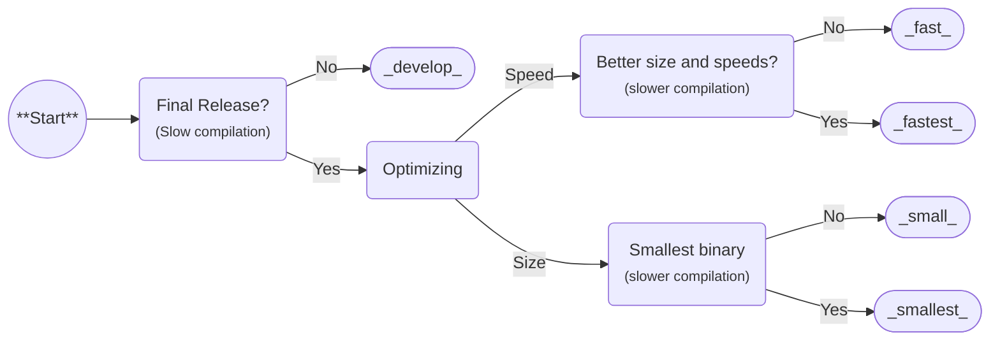

Many [cargo profiles](https://github.com/BrokenSource/Pyaket/blob/main/pyaket/Cargo.toml) are defined to optimize for different use cases.

## Flowchart

As a general rule of thumb for what [profile](#options) to use, you can follow:



<!-- Todo: Better wording, presentation, visual clutter -->

## Options

=== develop
    asdasd
=== fast

### `develop`

Fastest build times, ideal for iterative development.

<div class="grid cards" markdown>
- 🟢 **Strengths**
    - Iterative development
    - Fastest build times
- 🔴 **Trade-offs**
    - Larger binary size
    - Slower runtime
</div>

### `fast`

### `fastest`

Same as [fast](#fast), but with [Fat LTO](https://doc.rust-lang.org/cargo/reference/profiles.html#lto) enabled.

<div class="grid cards" markdown>
- 🟢 **Strengths**
    - Slightly smaller binaries
    - Slightly faster binaries
- 🔴 **Trade-offs**
    - Slower build times
</div>

### `small`

### `smallest`

Same as [small](#small), but with [Fat LTO](https://doc.rust-lang.org/cargo/reference/profiles.html#lto) enabled.

## Using a profile

### Python code

```python
from pyaket import PyaketProject

project = PyaketProject()
project.release.profile = "name"
```

### Command line

```bash
pyaket release --profile name (...)
```
