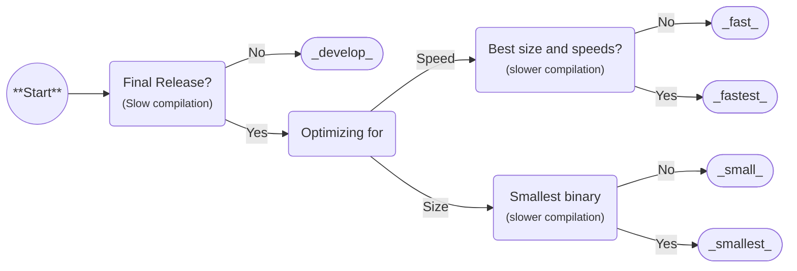

Many [:simple-rust: Build Profiles](https://doc.rust-lang.org/cargo/reference/profiles.html) are defined to optimize for different use cases.

## Flowchart

As a general rule of thumb for what option to use, you can follow:



!!! tip "**Suggestion:** Always use smallest for releases, plenty fast and portable 😉"

## Usage

=== ":simple-python: Python"
    ```python
    project.release.profile = "fast"
    ```

=== ":fontawesome-solid-terminal: Command"
    ```bash
    pyaket release --profile fast
    ```

=== ":simple-rust: Rust"
    ```bash
    cargo build --profile fast
    ```

## Benchmarks

<!-- Note: Feel free to run scripts/benchmark-profiles.py and submit results! -->

- **Size:** Base compiled binary size, only including the uv runtime.
- **Statup:** Startup overhead time added by Pyaket until Python runs an empty command.
- **Cold:** Time to build without any prior build cache.
- **Warm:** Time to rebuild after a prior build cache exists.

### x86_64-unknown-linux-gnu

| Profile  | Size     | Startup | Cold    | Warm    |
| :------- | -------: | ------: | ------: | ------: |
| develop  | 59.03 MB | 89.3 ms |  66.0 s |   8.9 s |
| fast     | 45.10 MB | 82.6 ms | 157.7 s | 100.3 s |
| fastest  | 40.54 MB | 82.2 ms | 258.3 s | 206.0 s |
| small    | 36.87 MB | 85.8 ms |  99.8 s |  58.1 s |
| smallest | 29.74 MB | 84.0 ms | 173.5 s | 132.3 s |

<sup><b>System:</b> Ryzen 9 5900X, 2x3200 MT/s DDR4 CL16 2Rx8<sup>
